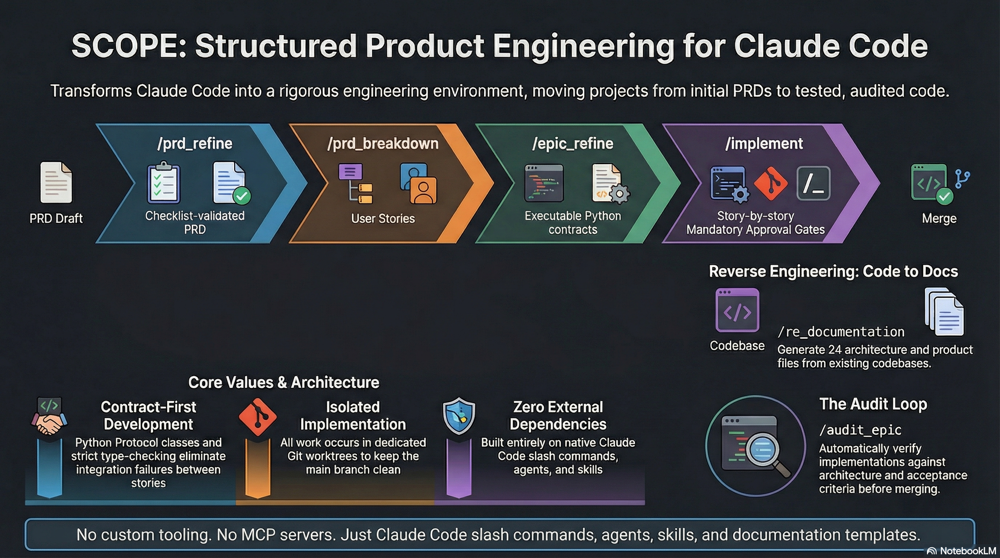

Also support Codex (but I'm too lazy to update the picture)
<p align="center">
  
</p>

# SCOPE

**Simple Claude/Codex Orchestrator for Product Engineering**

SCOPE turns Claude Code or OpenAI Codex into a structured product engineering environment. It gives you slash commands that take a product from PRD to implemented, tested, and audited epics — with approval gates at every step.

Claude: idea → /prd_create → /prd_refine → /prd_breakdown → /epic_refine → /implement → /wrap_epic
Codex: idea → scope:prd_create → scope:prd_refine → scope:prd_breakdown → scope:epic_refine → scope:implement → scope:wrap_epic

**Already have code but no docs?** Use `/re_documentation` or `run scope:re_documentation` to reverse engineer the product and architecture documentation from your existing codebase.

No custom tooling. No MCP servers. Just commands, agents, skills, and documentation templates.

**NOTE:** for Codex, replace "/" with "run scope:"

---

## What It Does

### Forward Engineering (PRD to Code)

- **`/prd_create`** — Interview the user to create a lightweight first-pass PRD before refinement
- **`/prd_refine`** — Interactively refine a product requirements document using a checklist-driven approach
- **`/prd_breakdown`** — Break the PRD into implementable epics with architecture and dependency analysis
- **`/epic_refine`** — Refine each epic through 4 approval gates: business validation, architecture design, spec generation, story breakdown with executable Python contracts
- **`/implement`** — Implement an epic story-by-story in a git worktree. Developer writes code and tests. Architect scaffolds shared modules first
- **`/implement_tdd`** — Same as above, but SDET writes tests first, then developer implements to make them pass
- **`/audit_epic`** — Audit the implementation against architecture, acceptance criteria, and specs. Auto-generates fix stories for all findings
- **`/sync_product`** — Update product documentation when implementation reveals scope changes

### Reverse Engineering (Code to Docs)

- **`/re_documentation`** — Reverse engineer product and architecture documentation from an existing codebase. Two agents scan your code, interview you about decisions and rationale, then generate 24 documentation files (9 product + 15 architecture)

### Session Continuity

- **`/session-handoff`** / **`scope:session-handoff`** — Create an ephemeral `session-handoff.md` at the active worktree or project root when a long session has become inefficient. The file captures enough durable context for a fresh agent to assess the state and recommend the next course of action without treating unconfirmed next steps as instructions. The file is overwritten on each run and should not be tracked by git.

Every command has user approval gates. Nothing is merged without your sign-off.

## How It Works

SCOPE uses Claude Code or codex built-in features:

### Claude

- **Slash commands** (`.claude/commands/`) define multi-phase workflows with approval gates
- **Agent definitions** (`.claude/agents/`) give Claude specialized personas (architect, developer, SDET, product owner, reverse-engineer-po, reverse-engineer-architect)
- **Skills** (`.claude/skills/`) provide documentation templates (Arc42+C4 for technical, Atlassian Blueprint for product)
- **TaskCreate/TaskUpdate** manage story dependencies and sequencing
- **Git worktrees** isolate implementation from the main branch

### Codex

- **commands** (`plugins/scope/commands/`) define multi-phase workflows with approval gates
- **Agent definitions** (`plugins/scope/agents/`) give Claude specialized personas (architect, developer, SDET, product owner, reverse-engineer-po, reverse-engineer-architect)
- **Skills** (`plugins/scope/skills/`) provide documentation templates (Arc42+C4 for technical, Atlassian Blueprint for product)
- **TaskCreate/TaskUpdate** manage story dependencies and sequencing
- **Git worktrees** isolate implementation from the main branch

No external runtime dependencies. No persistent state files.

## Installation

Clone Scope first:

```bash
git clone https://github.com/PatD42/scope.git
cd scope
```

### macOS and Linux

**Install to a project** (commands available only in that project):

```bash
./install.sh /path/to/your-project
```

**Install to user directory** (commands available in all projects):

```bash
./install.sh --user
```

**Install to current directory** (default):

```bash
./install.sh
```

### Windows

Run these commands from Command Prompt. In PowerShell, prefix the installer with `./` or `.\`.

**Install to a project** (commands available only in that project):

```bat
install.bat "C:\path\to\your-project"
```

**Install to user directory** (commands available in all projects):

```bat
install.bat --user
```

**Install to current directory** (default):

```bat
install.bat
```

Both installers copy the same commands, agents, skills, governance files, and Codex plugin assets. For project installs, they also create `.scope/config.yaml` when it does not already exist; edit it to set your project name and tracking preferences.

## Quick Start

**Starting from an idea or a PRD:**

```
1. /prd_create              → Create a first-pass PRD if you do not have one
2. /prd_refine              → Refine it interactively
3. /prd_breakdown           → Get epics with dependencies
4. /epic_refine EPIC-001    → Refine the first epic (4 approval gates)
5. /implement EPIC-001      → Implement it story-by-story in a worktree
6. Review and merge the worktree when satisfied
```

**Starting from existing code:**

```
1. /re_documentation        → Reverse engineer product + architecture docs
2. /prd_refine              → Refine/extend the PRD for new features
3. /prd_breakdown           → Break into epics
4. Continue as above
```

## Project Structure (Target Project)

After installation, your project will generate this structure as you work:

```
your-project/
├── .claude/
│   ├── commands/           # Slash commands
│   ├── agents/             # Agent definitions
│   ├── skills/             # Documentation templates
│   └── governance/         # Quality and lifecycle rules
├── plugins/
│   └── scope/
│       ├── commands/       # Codex command playbooks
│       ├── agents/         # Codex role instructions
│       ├── skills/         # Shared templates + Codex workflow skill
│       ├── governance/     # Quality and lifecycle rules
│       ├── docs/           # Scope reference docs for Codex
│       ├── scripts/        # Helper scripts such as scope-command
│       ├── .codex-plugin/  # Codex plugin metadata
│       └── .mcp.json       # MCP server configuration
├── .scope/
│   └── config.yaml         # Project configuration
├── docs/
│   ├── product/            # Product docs (strategy, definition, decisions)
│   ├── architecture/       # Technical docs (Arc42 sections 01-13)
│   ├── epics/{epic-id}/    # Per-epic docs (acceptance criteria, file plans, ADRs)
│   └── releases/           # Release documentation
├── wip/
│   └── {epic-id}/          # Git worktree per epic (implementation happens here)
└── src/                    # Your application code
```

## Key Concepts

**Contract-first development** — `/epic_refine` produces a `contracts.py` with Python Protocol classes. `mypy --strict` verifies every story implements the agreed interfaces. No more integration failures hidden by mocks.

**File plan intent** — Every file in a story has a 600-1200 char description covering WHAT, WHY, RESPONSIBILITIES, DEPENDENCIES, and RELATED MODULES. This is the source of truth for implementation.

**Audit loop** — After implementation, `/audit_epic` checks architecture compliance, acceptance criteria coverage, code quality, and stub detection. Fix stories are generated for all findings. Max 2 audit cycles, then escalate.

**Git worktrees** — Implementation happens in `wip/{epic-id}` on branch `epic/{epic-id}`. Main branch stays clean. You merge when satisfied.

## Requirements

- [Claude Code](https://docs.anthropic.com/en/docs/claude-code) CLI
- Git

## License

MIT
