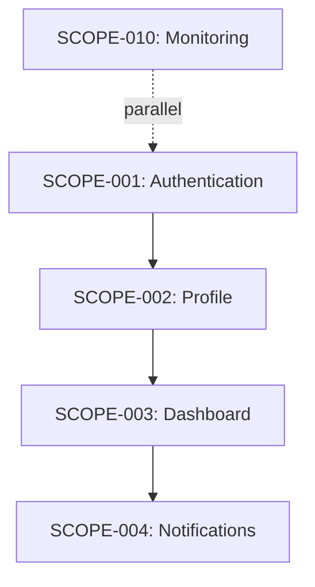

# Epic Map Template

Use this template when updating Product Definition with epic breakdown summary.

**CRITICAL:** Group epics by release phase to prevent forgetting post-MVP features.

```markdown
## Epic Breakdown

This PRD has been broken down into [N] epics for implementation.

### MVP Epics (v1.0 Launch) ⭐

These [X] epics are required for minimum viable product launch:

| Epic ID | Title | Capabilities | Type | Priority | Status |
|---------|-------|--------------|------|----------|--------|
| SCOPE-001 | Authentication | User Registration, Login/Logout, ... | Foundation | High | Backlog |
| SCOPE-002 | Profile Management | User Profile, Settings, ... | Feature | High | Backlog |
| SCOPE-003 | Dashboard | Overview, Analytics, ... | Feature | High | Backlog |

**MVP Completion Criteria:** All MVP epics must be complete before v1.0 launch.

### Phase 2 Epics (Post-MVP Enhancements) 📦

These [Y] epics enhance MVP functionality:

| Epic ID | Title | Capabilities | Type | Priority | Status |
|---------|-------|--------------|------|----------|--------|
| SCOPE-004 | Notifications | Email, In-app, Push, ... | Feature | Medium | Backlog |
| SCOPE-005 | Advanced Analytics | Custom Reports, Exports, ... | Feature | Medium | Backlog |

### Future Epics (Long-term) 🔮

These [Z] epics are planned for future releases:

| Epic ID | Title | Capabilities | Type | Priority | Status |
|---------|-------|--------------|------|----------|--------|
| SCOPE-010 | Mobile App | iOS, Android Support | Feature | Low | Backlog |

### Epic Dependencies



### Epic Prioritization

Based on customer problems, technical dependencies, and release phase:

**MVP (v1.0) - Must Complete First:**
1. SCOPE-001 (Authentication) ⭐ MVP - Foundation, addresses "secure access" problem
2. SCOPE-002 (Profile Management) ⭐ MVP - Depends on Auth, core user functionality
3. SCOPE-003 (Dashboard) ⭐ MVP - Delivers key user value

**Phase 2 - After MVP Launch:**
4. SCOPE-004 (Notifications) 📦 Phase 2 - Enhances engagement
5. SCOPE-005 (Advanced Analytics) 📦 Phase 2 - Power user features

**Future - Long-term:**
10. SCOPE-010 (Mobile App) 🔮 Future - Platform expansion

**Total:** [N] epics ([X] MVP, [Y] Phase 2, [Z] Future)
```
