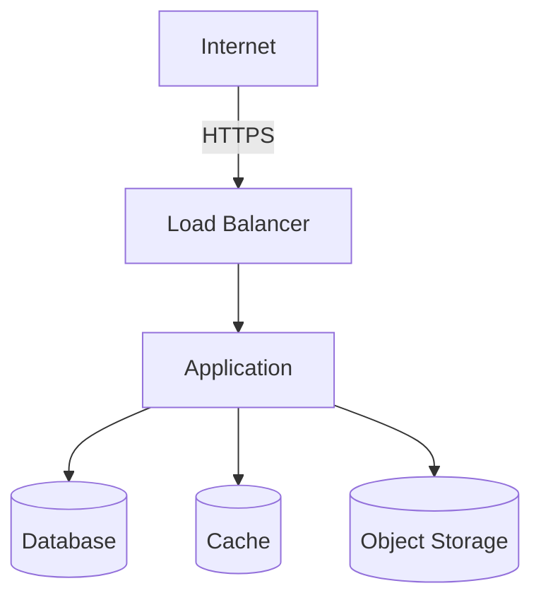

# Operations Overview

## System Summary

{One-paragraph description of what this system does and its operational profile.}

## Component Inventory

| Component | Technology | Hosting | Purpose | Owner | Critical |
|-----------|-----------|---------|---------|-------|----------|
| {name} | {tech} | {where it runs} | {what it does} | {team/person} | {Yes/No} |

## Access Points

| Resource | URL / Endpoint | Access Method | Credentials Location |
|----------|---------------|---------------|---------------------|
| Production app | {url} | {browser/API/CLI} | {where creds are stored} |
| Admin console | {url} | {browser} | {where creds are stored} |
| CI/CD pipeline | {url} | {browser} | {SSO/credentials} |
| Monitoring dashboard | {url} | {browser} | {SSO/credentials} |
| Log aggregation | {url} | {browser/CLI} | {SSO/credentials} |

## Architecture Diagram (Operational View)

{Simplified infrastructure diagram focused on operational concerns — what runs where, how traffic flows, where data is stored. Use Mermaid.}

## Service Dependencies

| Dependency | Type | Impact if Down | Fallback | SLA |
|-----------|------|---------------|----------|-----|
| {service} | {External/Internal} | {what breaks} | {degraded mode?} | {uptime %} |

## On-Call & Contacts

| Role | Name | Contact | Schedule |
|------|------|---------|----------|
| Primary on-call | {name} | {phone/slack} | {rotation schedule} |
| Escalation | {name} | {phone/slack} | {when to escalate} |
| Vendor support | {vendor} | {support channel} | {SLA response time} |

## Related Documentation

- [Environments](environments.md) — Environment matrix and access
- [Deployment Runbook](runbooks/deployment.md) — Deploy and rollback
- [Monitoring & Alerting](runbooks/monitoring-alerting.md) — Dashboards and alerts
- [Disaster Recovery](runbooks/disaster-recovery.md) — DR plan and failover
- [Architecture - Deployment](../architecture/07-deployment.md) — Architecture-level deployment view
- [Architecture - Operations](../architecture/08-cross-cutting/operations.md) — Operational patterns
