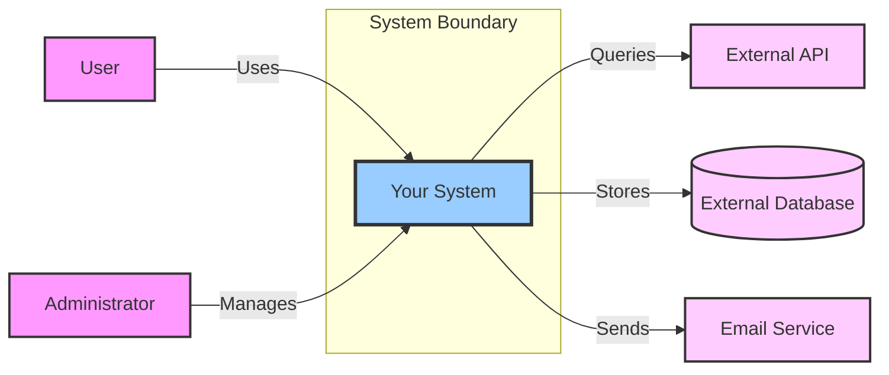

# Architecture - Context & Scope

---

## System Context (C4 Level 1)

<!-- Diagram and description showing the system and its external dependencies. -->

### Context Diagram

<!-- Insert C4 Context diagram here (Level 1) using Mermaid -->

### External Interfaces

<!-- What external systems, users, and services does this system interact with? -->

| External Entity | Type | Relationship | Protocol/Interface |
|----------------|------|--------------|-------------------|
| | User/System | Sends/Receives | HTTP/API/etc. |

## Business Context

<!-- What business processes does this system support? -->

### Input/Output

**Inputs**:
-

**Outputs**:
-

## Technical Context

<!-- What are the technical communication channels and protocols? -->

| Channel | Protocol | Data Format | Security |
|---------|----------|-------------|----------|
|         | REST API | JSON        | TLS 1.3  |

---

