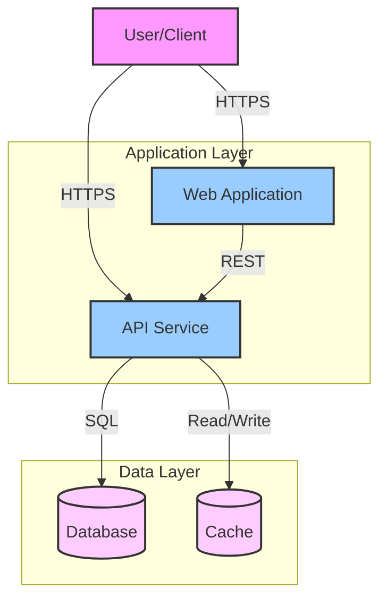
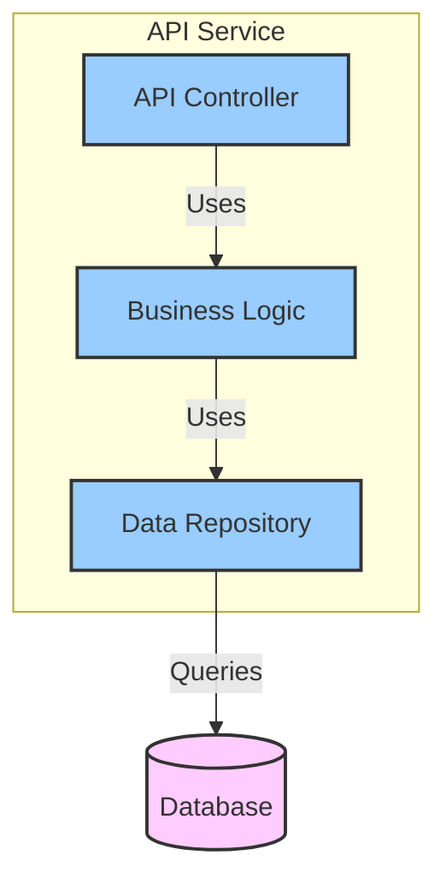

# Architecture - Building Block View

---

## Container View (C4 Level 2)

<!-- Show the high-level shape of the software architecture and how responsibilities are distributed. -->

### Container Diagram

<!-- Insert C4 Container diagram here (Level 2) using Mermaid -->

### Containers

| Container | Technology | Responsibility |
|-----------|-----------|----------------|
| | | |

## Component View (C4 Level 3)

<!-- Decompose each container to show major structural building blocks. -->

### [Container Name] Components

<!-- Insert C4 Component diagram for this container (Level 3) using Mermaid -->

#### Component: [Component Name]

**Responsibility**:

**Dependencies**:
-

**Interfaces**:
-

**Technical Specifications**: <!-- Link to detailed specs -->
- API Contract: [13-specs/api/{service}.yaml](./13-specs/api/)
- Data Schema: [13-specs/schemas/domain/{entity}.yaml](./13-specs/schemas/domain/)
- Database: [13-specs/database/](./13-specs/database/)
- Error Codes: [13-specs/errors/by-domain/{domain}.yaml](./13-specs/errors/by-domain/)

## Whitebox View

<!-- Detailed view of key components. Create child pages if exceeding 300 words per component. -->

### [Component Name] Internals

**Structure**:

**Key Classes/Modules**:
-

**Important Patterns**:
-

---

