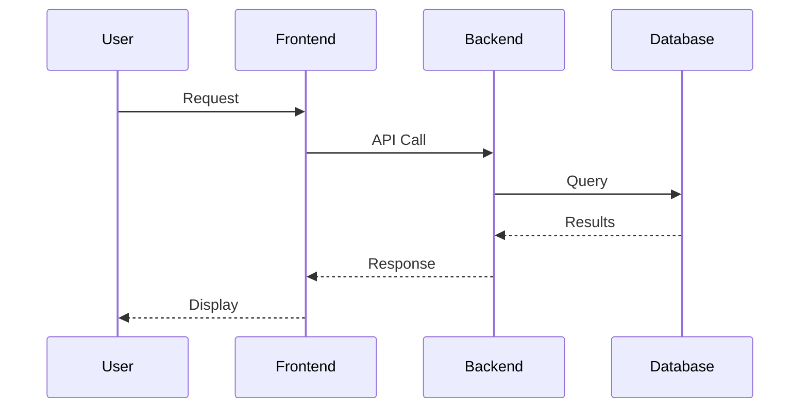
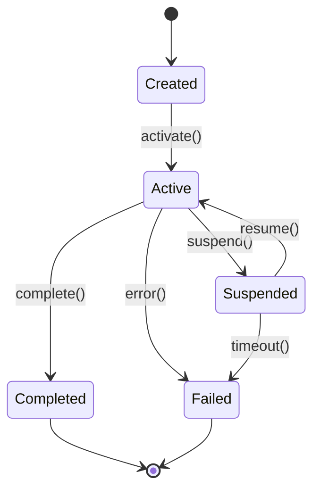

# Architecture - Runtime View

---

## Key Scenarios

<!-- Document the most important runtime scenarios showing how components interact. -->

### Scenario 1: [Scenario Name]

**Description**: What is this scenario?

**Trigger**: What initiates this scenario?

**Sequence Diagram**:



**Steps**:
1.
2.
3.

**Error Handling**:
-

### Scenario 2: [Scenario Name]

**Description**:

**Trigger**:

**Sequence Diagram**:

```mermaid
sequenceDiagram
    participant Actor
    participant SystemA
    participant SystemB

    Actor->>SystemA: Action
    SystemA->>SystemB: Process
    SystemB-->>SystemA: Result
    SystemA-->>Actor: Response
```

**Steps**:
1.
2.
3.

**Error Handling**:
-

## State Transitions

<!-- If the system has important stateful behavior, document state machines. -->

### [Entity] State Machine



**States**:
- Created: Initial state
- Active: Actively processing
- Suspended: Temporarily paused
- Completed: Successfully finished
- Failed: Error occurred

**Transitions**:
- activate(): Move from Created to Active
- suspend(): Temporarily pause processing
- resume(): Continue from suspended state
- complete(): Successfully finish
- error(): Handle critical failure
- timeout(): Handle timeout from suspended state

---

