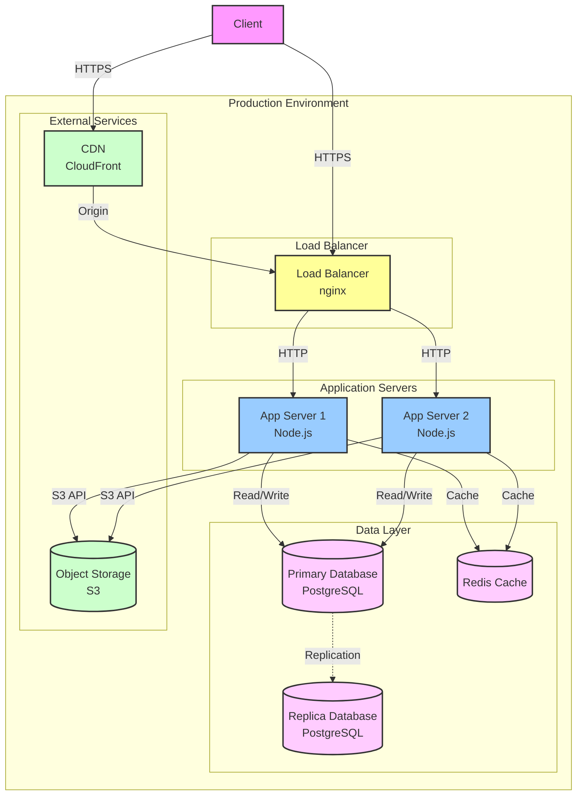

# Architecture - Deployment

---

## Deployment Strategy

<!-- How is the system deployed? What deployment patterns are used? -->

**Deployment Type**: [Blue/Green / Canary / Rolling / etc.]

**Deployment Frequency**: [Continuous / Daily / Weekly / On-demand]

**Rollback Strategy**:

## Infrastructure Overview

<!-- High-level view of the infrastructure. -->

### Environments

| Environment | Purpose | URL | Infrastructure |
|------------|---------|-----|----------------|
| Development | | | |
| Staging | | | |
| Production | | | |

## Deployment Diagram

<!-- Show how software artifacts map to hardware/infrastructure using Mermaid. -->

### Production Deployment

**Nodes**:

| Node | Type | Specifications | Deployed Artifacts |
|------|------|---------------|-------------------|
| | VM/Container/Serverless | CPU/RAM/Storage | |

**Network Configuration**:
-

**Load Balancing**:
-

## Infrastructure as Code

<!-- What tools and approaches are used for infrastructure provisioning? -->

**Tools**: [Terraform / CloudFormation / Ansible / etc.]

**Repository**:

**Key Modules**:
-

## Deployment Pipeline

<!-- How does code get from commit to production? -->

### Pipeline Stages

1. **Build**:
2. **Test**:
3. **Package**:
4. **Deploy to Staging**:
5. **Integration Tests**:
6. **Deploy to Production**:
7. **Smoke Tests**:

### CI/CD Tools

**CI/CD Platform**: [Jenkins / GitHub Actions / GitLab CI / etc.]

**Configuration**:

## Monitoring & Observability

<!-- How is the deployed system monitored? -->

**Monitoring Tools**:
-

**Key Metrics**:
-

**Alerting**:
-

---

**Contributors**: DevOps
