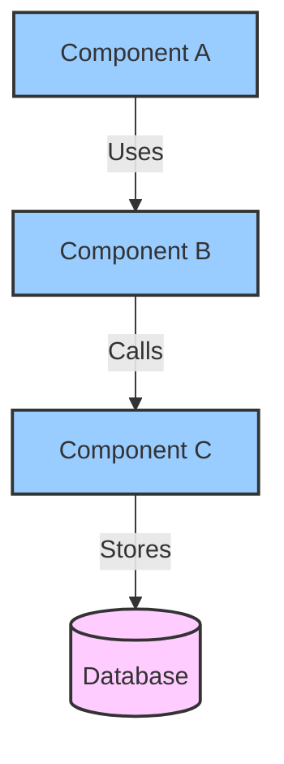
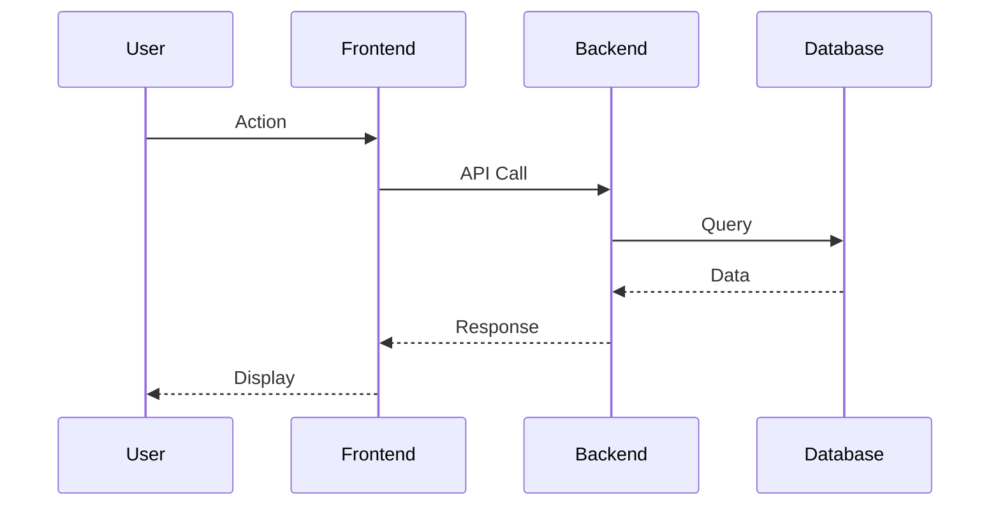

# Epic Architecture: [Epic Title]

---

## Meta: Phase & Agent Information

**Phase**: Phase 2 - Architecture
**Agent Role**: Architect
**Created During**: Architecture Phase - Design Stage
**Prerequisites**: System Context approved, Epic Details, Product Reference

---

## Context Dependencies

**Required Context (must exist before this document)**:
- [{epic-id}: System Context](link) - Integration points, inherited constraints, patterns to follow
- [{epic-id}: Epic Details](link) - User stories, scope, success criteria
- Product Reference: Existing system architecture, APIs, data models
- Product Reference: UI & Workflows (for frontend architecture)

**Provides Context For (documents that depend on this)**:
- [{epic-id}: ADR](link) - Architectural decisions reference this design
- [{epic-id}: Test Strategy](link) - Test boundaries align with architecture
- `13-specs/` - Machine-readable specifications for Auto Claude
- Development Phase: Auto Claude implements based on specs

---

## Architectural Overview

<!-- How does this epic fit into the overall architecture? -->

**Affected Components**:
-

**New Components**:
-

## Component Diagrams

<!-- C4 Level 3/4 diagrams specific to this epic using Mermaid. -->

### Component Structure




**Components**:

| Component | Responsibility | Dependencies |
|-----------|---------------|-------------|
| | | |

## Data Model

<!-- Data model changes for this epic. -->

### New Entities

| Entity | Attributes | Relationships |
|--------|-----------|---------------|
| | | |

### Modified Entities

| Entity | Changes | Migration Required |
|--------|---------|-------------------|
| | | Yes/No |

### Database Schema

```sql
-- Schema changes for this epic

CREATE TABLE example (
    id SERIAL PRIMARY KEY,
    name VARCHAR(255) NOT NULL
);
```

## API Design

<!-- API endpoints and contracts for this epic. -->

### New Endpoints

#### `GET /api/v1/resource/{id}`

**Description**:

**Request**:
```json
{
}
```

**Response**:
```json
{
}
```

**Status Codes**:
- 200: Success
- 404: Not found
- 500: Server error

### Modified Endpoints

| Endpoint | Changes | Breaking Change |
|----------|---------|----------------|
| | | Yes/No |

## Integration Points

<!-- How does this epic integrate with other systems? -->

| Integration | Type | Protocol | Data Flow |
|------------|------|----------|-----------|
| | Inbound/Outbound | REST/GraphQL/etc. | |

## Sequence Diagrams

<!-- Key interaction flows for this epic using Mermaid. -->

### Flow 1: [Flow Name]




## Security Considerations

<!-- Security implications of this epic. -->

**Authentication**:

**Authorization**:

**Data Protection**:

**Security Reviews**: [Required / Not Required]

## Performance Considerations

<!-- Performance implications and optimizations. -->

**Expected Load**:

**Performance Targets**:
-

**Optimization Strategies**:
-

## Infrastructure Changes

<!-- Infrastructure or deployment changes needed. -->

**New Services**:
-

**Configuration Changes**:
-

**Resource Requirements**:
-

## Generated Specifications

<!-- Links to machine-readable specs generated in 13-specs/ for Auto Claude consumption. -->
<!-- Fill this section after spec_generation phase completes. -->

| Type | Path | Description |
|------|------|-------------|
| API | `13-specs/api/{epic-id}-*.yaml` | API contracts (OpenAPI 3.0.3) |
| Schema | `13-specs/schemas/domain/{entity}.json` | Domain entity schemas (JSON Schema) |
| Errors | `13-specs/errors/by-domain/{epic-id}.yaml` | Error codes and messages |

**Note**: These specs are the source of truth for Auto Claude implementation. Design decisions in this document inform the specs; specs are what gets implemented.

---
